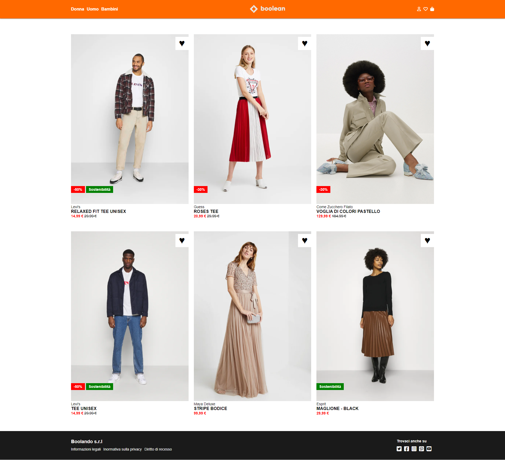

# Boolean Academy - Boolando Products Details
This is a solution to the exercice of - Classe #92 - 08 Febbraio 2023.


## Table of contents

- [Overview](#overview)
  - [The exercice](#the-exercice)
  - [Screenshot](#screenshot)
  - [Links](#links)
- [My process](#my-process)
  - [Built with](#built-with)
  - [What I learned](#what-i-learned)


## Overview

### The exercice

Students should be able to:

- View the optimal layout for the website using CSS Flexbox and Position (Absolute and Relative)
- Set up the hover state on the products card (change of the image and color on the heart icon)

### Screenshot
Below is how the page should looks like




### Links

- Solution URL: [https://github.com/filecc/html-css-boolando](https://github.com/filecc/html-css-boolando)
- Live Site URL: [https://filecc.github.io/htmlcss-discord/](https://filecc.github.io/htmlcss-discord/)

## My process

### Built with

- Semantic HTML5 markup
- CSS custom properties
- Flexbox

### What I learned

We were required to use Flexbox (with no media query and no other framework). I have create some usueful class, like bootstrap, to helmp me in the process.


```html
<!-- links -->
<div class="container d-flex align-center space-between">
            <div>
                <p>Booleando s.r.l</p>
                <ul class="d-flex">
                    <li>Informazioni legali</li>
                    <li>Informativa sulla privacy</li>
                    <li>Diritto di recesso</li>
                </ul>
            </div>
<!-- /links -->
```

```css
.d-flex{
    display: flex;
    flex-flow: row wrap;
}

.flow-column{
    flex-flow: column wrap;
}

.justify-center{
    justify-content: center;
}
```

I learned deeply how to use 

```css
div {
    position: absolute;
}
``` 
and managed correctly and with no much difficulties to add icon and new images to the card products. 
